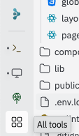
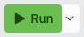
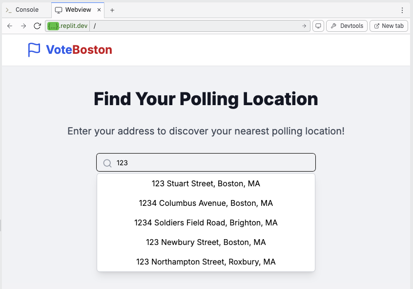
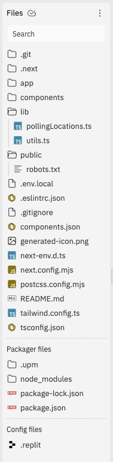
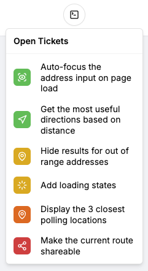
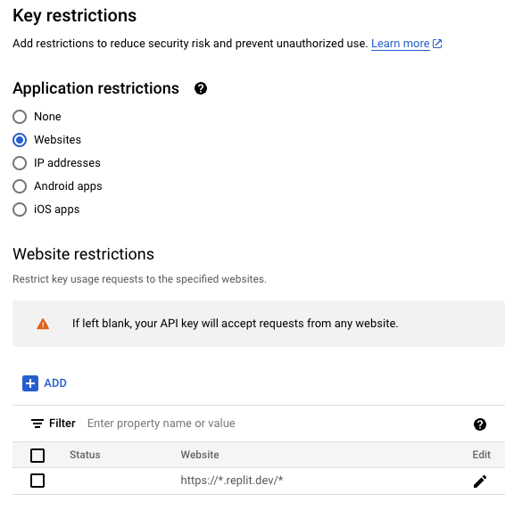

# VoteBoston

**VoteBoston** is a web app to help Boston residents find their nearest polling location using polling location data from the [city of Boston](https://data.boston.gov/dataset/polling-locations-20221). It is intentionally incomplete but includes instructions on how to finish the project with prompt engineering. By the end of the project, you will have a working web app that allows users to find their nearest polling location.

## Prerequisites

You must first create a [Replit account](https://replit.com/) and remix the [Vote Boston application](https://replit.com/@TrevorUptain1/vote-boston). Then, request an API key using [this form](https://tally.so/r/w4p5qY) (students will receive the password for the form via email).

You will also need a [ChatGPT](https://chatgpt.com), [Claude](https://claude.ai), or [Gemini](https://gemini.google.com) account to complete the prompt engineering exercises.

## Setup

### Step 1: Add your API key to Replit

In the Replit workspace, click the 'All Tools' button on the left sidebar.



Search for 'Secrets' and click on it. Then, add the following secret to the Replit environment:

- **Key**: `NEXT_PUBLIC_GOOGLE_MAPS_API_KEY`
- **Value**: `The Google Maps API key that was emailed to you`

**If you already started working on this in class:** Please be careful - do not paste the new API key directly into `.env.local`! Instead you can either 1) Delete your previous app and create a new remix or 2) Replace the existing `env.local` with the following snippet:

```
NEXT_PUBLIC_GOOGLE_MAPS_API_KEY=${{secrets.NEXT_PUBLIC_GOOGLE_MAPS_API_KEY}}
```

Then follow the instructions above to add `NEXT_PUBLIC_GOOGLE_MAPS_API_KEY` as an environment variable in Replit.

### Step 2: Run the app

Once you're in the Replit workspace, click the Run button at the top of the page:



It will take a minute or so to start the app.

### Step 3: View the app

Once the app is running, click on the Webview button. You should be able to see and interact with the app. Try typing an address into the search bar and selecting an option from the dropdown:



### Step 4: View the files

You can view the files in the Replit workspace in the left sidebar:



This is a Next.js app written with TypeScript. It contains both the frontend and backend code in a single project.

> **Keep this README open in a second tab.** If you get lost, you can always refer back to it.

- Open `app/data/polling-locations.csv`. This is the polling location data from the city of Boston.
- Open `app/api/nearest-polling-location/route.ts` and take a look at the code. This is the backend HTTP route that is called when you search for a polling location. It returns the single nearest polling location from a list of polling locations given a latitude and longitude.
- Open `app/page.tsx` and take a look at the code. This is the frontend code that loads Google Maps and allows you to search for a polling location.

This code may feel a bit out of your depth, especially if you don't have experience with TypeScript or Next.js. That's okay! The whole point of this project is to let AI do the heavy lifting for us. With prompt engineering, it's often better to understand the code at a high level, rather than in depth.

> Why is it better to understand the code at a high level? **Because our attention is limited.** If we try to understand the code in depth, we'll get lost in the details and not see the big picture. By understanding the big picture, we can make better decisions about how to improve the app faster.

The goal of this app is to make it easy for Boston residents to find their nearest polling location. However, while we've made a lot of progress, this app is not ready to ship to real users yet. Here are just two of the issues that we need to fix:

- You may have noticed that the page content "jumps" to the middle of the page momentarily the first time you select an address. We need to add a loading state while the map loads.
- We should present at least 2-3 alternative polling locations if they're relatively close to the target address. By limiting the user to a single location, we may unintentionally hinder their voting experience.

In the next step, we'll use AI to fix these and other issues that currently block us from shipping to production.

### Step 5: Prompt Engineering

In the top right corner of the page, there is a button with a code icon. Click it to view the open tickets for this project:



The tickets are color coded by difficulty. Start at the top and work your way down.

Each ticket page contains instructions and ideas for how to complete the ticket with prompt engineering. Follow these guidelines to complete the remaining tickets successfully:

- **Do not modify the code directly**. Instead, use prompt engineering to change the code in a way that fixes the issue.
- **Start with a high-level overview of the code**. Understand the basics of what you're trying to accomplish before you ask for help from AI.
- **Paste the entire file you need to change into the prompt**. This ensures that the AI has all the information it needs to make the changes. In some cases, you may need to paste multiple files into the prompt.
- **Coach the AI step by step**. If you have an idea of how to fix the issue, suggest it to the AI. If there is a part of the code that you don't understand, tell the AI what is confusing you.
- **Let AI resolve bugs and edge cases**. You can resolve small bugs yourself, but if the AI gives you code containing a bug, ask it to fix the bug. Give it examples, logs, and your inklings of what the problem might be.
- **Use the hints**. Each task page contains a hint section that provides an example prompt you can use to complete the task. However, you should try to complete the task without using the hint first.

You should use a good system prompt that instructs the AI to make minimal changes to out-of-scope parts of the code. Here is a simple one that you can try:

```
Respond with thoughtful, well-written, clean code. Only include comments which should end up in the production code.

Focus on the task at hand. Do not make unnecessary material changes to the code, comments, format, or styling - they may exist for a reason.
```

## Contributing

If you made a great change and would like to contribute it to the project, please create a pull request on [GitHub](https://github.com/trevoruptain/vote-boston).

## Using your own API key

If you want to use your own API key, create a GCP account and enable the Google Maps API. Then, create an API key on the Credentials page and restrict it to Replit:



Then, add the API key to the Replit environment:

- **Key**: `NEXT_PUBLIC_GOOGLE_MAPS_API_KEY`
- **Value**: `Your Google Maps API key`

For local development, use the real API key in `.env.local`:

```
NEXT_PUBLIC_GOOGLE_MAPS_API_KEY=your_api_key
```

Before commiting to GitHub, uncomment the `.env.local` file in `.gitignore` (see the comment in the file).
